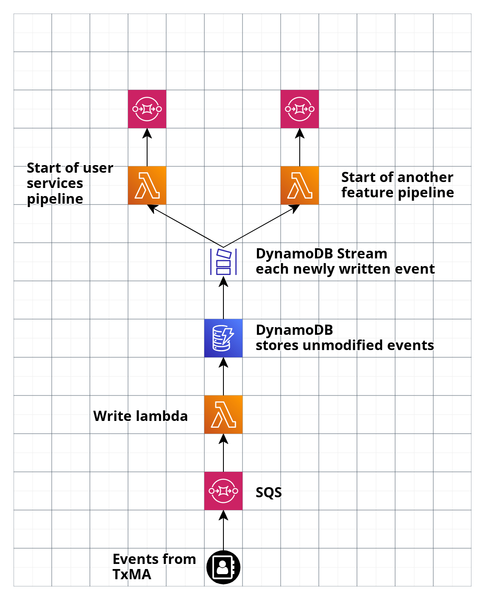

# Store all event data unmodified

## Decision

We will store all events we receive from TxMA unmodified.

This will allow us replay past events to:

- Backfill a data store for a new feature
- Replay any events that get 'lost' in our system

We will also be able to use this data to debug any problems with the events that TxMA send us.

### Architecture

We will insert a new compenent before the existing pipeline to process a user's services.
There will be a new lambda function which writes the unmodified event from TxMA to a new DynamoDB table.
We'll then subscribe the lambda function at the start of the user services pipeline to the DynamoDB Stream for this new table.

We can only subscribe two lambda functions to a DynamoDB stream.
In the future when we have more feature pipelines we'll need to create a 'fan-out' system probably with SNS or EventBridge to subscribe more than two lambdas.
We'll design this system and add it in when we need it.

## Context

We receive an event from TxMA whenever a user takes certain actions in our system - see [the ADR](https://github.com/alphagov/digital-identity-architecture/pull/279) for more details.
Currently we only receive the event when a user successfully logs in, but we are planning to increase the number of event types as we add features.

The architecture we chose to save the services a user has logged into reformats the event before it's stored.This was done for good reason (see [the ADR](./0003-recording-service-usage-in-account.md)), but means we lose information from that event.

TxMA are unable to replay events for us, so if we receive an event and mis-process or fail to store it then it's lost.
We use AWS managed services (eg. SQS) to move events through our system, so 'losing' an event is unlikely but possible if AWS have an outage.

When we add new features we expect to build a new processing pipeline like the one that stores a user's services.
At the moment we cannot 'backfill' a new pipeline and data store with events that happened before.
This could cause delays in releasing new features if we have to wait to collect 'enough' data before we display it to users.

## Consequences

- We create a new store of user data
- We'll need to update our systems for deleteing accounts and SARs to cover this new data store
- We need to add a new system before our current pipeline to store the events
- We'll need to design and build an event fan-out system when we need to subscribe more than two lambdas to the DynamoDB stream.
